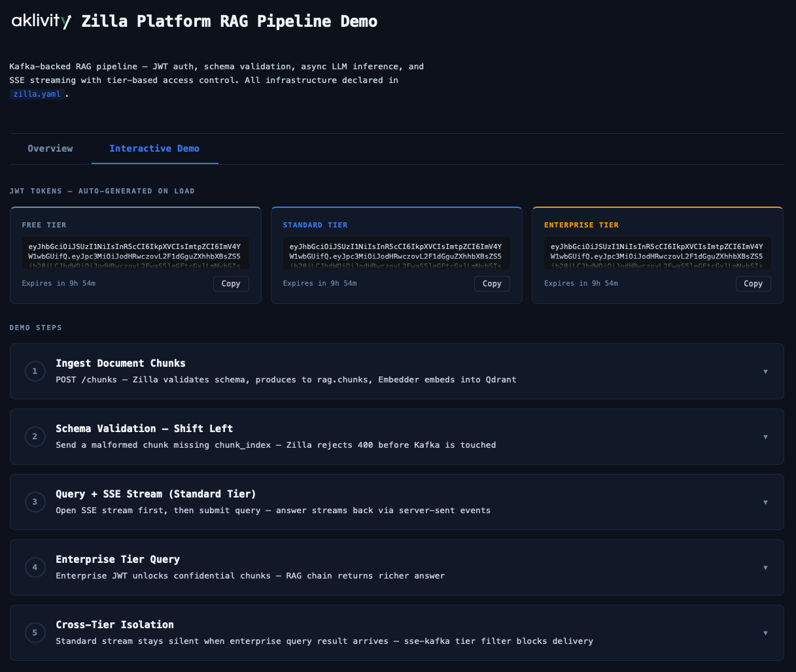
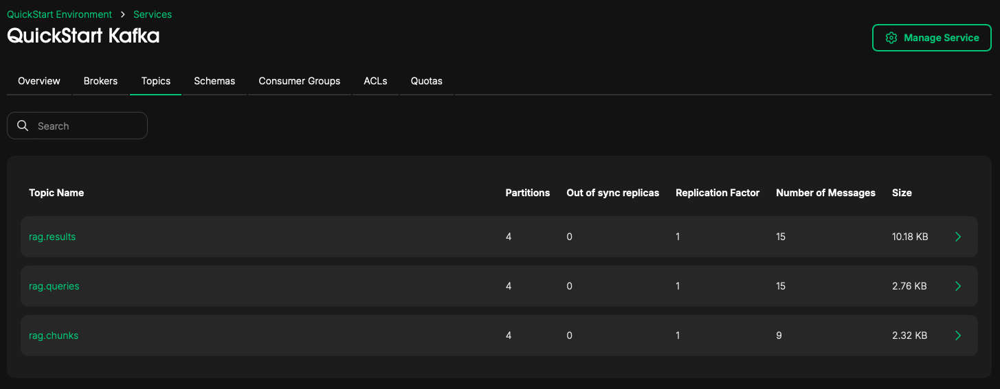

# Zilla Platform RAG Pipeline Demo

LLM inference is asynchronous by nature. Requests can take 5 to 30 seconds, trigger multiple agents, call external APIs, and stream results over time — but most AI systems are still built on synchronous HTTP APIs that break under production workloads.

That's why every AI platform eventually rebuilds the same infrastructure:

- streaming delivery
- auth and identity propagation
- data governance
- tenant-aware routing
- observability and replay
- scaling and reliability

None of this is AI logic.

Kafka provides the asynchronous backbone AI pipelines need — but Kafka alone is not AI-ready.

**Zilla Platform makes Kafka AI-ready** by turning it into a secure, real-time runtime for AI systems. With a single `zilla.yaml`, Zilla exposes Kafka through modern APIs and protocols while handling streaming, auth, schema enforcement, routing, and policy enforcement automatically.

**Kafka becomes the event-driven backbone for AI.**  
**Zilla becomes the AI gateway and runtime layer.**  
**Your services focus only on AI logic.**

---

## What this demo shows

| Problem                                                     | How Zilla Platform Solves It                                                                                   |
|-------------------------------------------------------------|----------------------------------------------------------------------------------------------------------------|
| Clients need Kafka SDKs to talk to Kafka                    | Clients use plain HTTPS APIs while Zilla writes directly to Kafka                                              |
| LLM responses take too long for normal HTTP                 | Zilla makes the pipeline asynchronous: clients get an immediate response and results stream back later via SSE |
| Bad data can corrupt vector stores                          | Zilla validates schemas at the gateway before data reaches Kafka                                               |
| Users should only access data for their tier                | Zilla extracts identity and tier from JWTs and enforces it automatically                                       |
| Enterprise AI results must not leak to other users          | Zilla filters streamed responses based on user identity and access tier                                        |
| Retries can create duplicate embeddings                     | Zilla uses idempotency keys to prevent duplicate processing                                                    |
| Every AI service ends up rebuilding Kafka and auth plumbing | Zilla handles APIs, streaming, auth, routing, and Kafka integration so AI services only focus on AI logic      |

---

## Architecture

```
┌──────────────────────────────────────────────────────────────────────────┐
│                             Zilla Platform                               │
│                                                                          │
│  POST /chunks   ──► http-kafka (produce) ──► rag.chunks topic            │
│                      key = ${idempotencyKey}                             │
│                      schema: chunk_schema (inline catalog)               │
│                                                                          │
│  POST /queries  ──► http-kafka (produce) ──► rag.queries topic           │
│                      key = ${idempotencyKey}                             │
│                      overrides:                                          │
│                        user-tier = ${guarded['authn_jwt'].identity}      │
│                                    ↑ JWT roles claim, set by Zilla       │
│                                                                          │
│  GET /results/{queryId}                                                  │
│    ──► sse (server)                                                      │
│      ──► sse-kafka (proxy)                                               │
│            filters:                                                      │
│              headers:                                                    │
│                tier = ${guarded['authn_jwt'].identity}                   │
│                       ↑ only delivers results matching caller's JWT      │
│                                                                          │
│       JWT guard · Inline schema validation · SASL/SCRAM                  │
└──────────────────────────────────────────────────────────────────────────┘
         │                    │                    ▲
    rag.chunks           rag.queries          rag.results
    (schema              (header:             (header:
     validated)           user-tier)           tier)
         │                    │                    │
         ▼                    ▼                    │
   ┌──────────┐       ┌──────────────┐             │
   │ Embedder │       │  RAG Chain   │─────────────┘
   │          │       │              │
   │ OpenAI   │       │ reads        │
   │ embed    │       │ user-tier    │
   │    ↓     │       │ from header  │
   │ Qdrant   │◄──────│ Qdrant search│
   │ upsert   │  vec  │ + vis filter │
   └──────────┘ search└──────┬───────┘
                             │
                          OpenAI LLM (gpt-4o-mini)
```

### Tier flow — end to end

```
-H "Authorization: Bearer $TOKEN_ENT"       (JWT roles: "enterprise")
  → Zilla validates JWT
  → overrides: user-tier = "enterprise"      (Kafka message header)
  → RAG chain: hdrs.get("user-tier") = "enterprise"
  → Qdrant filter: visibility IN [public, internal, confidential]
  → result produced: headers = {tier: "enterprise"}
  → sse-kafka filter: tier == JWT identity   → delivered to enterprise stream only
```

The client never declares their tier. It is extracted from the JWT by Zilla and injected as a Kafka header — tamper-proof.

---

## Services (Data Plane)

| Service           | Image                                     | Role                                                         |
|-------------------|-------------------------------------------|--------------------------------------------------------------|
| `gateway`         | `ghcr.io/aklivity/zilla-platform/gateway` | Protocol mediation, JWT auth, schema validation, SSE         |
| `kafka`           | `bitnamilegacy/kafka:3.5`                 | Event backbone (KRaft, SASL_PLAINTEXT)                       |
| `schema-registry` | `confluentinc/cp-schema-registry:8.1.0`   | JSON schema storage for downstream consumers                 |
| `kafka-init`      | `bitnamilegacy/kafka:3.5`                 | One-shot: topics, schemas, ACLs, quotas                      |
| `gateway-init`    | `eclipse-temurin:17-jdk`                  | One-shot: self-signed TLS certificates                       |
| `qdrant`          | `qdrant/qdrant:v1.12.0`                   | Vector store for semantic retrieval                          |
| `embedder`        | `python:3.12-slim`                        | Consumes `rag.chunks` → OpenAI Embeddings → Qdrant upsert    |
| `rag-chain`       | `python:3.12-slim`                        | Consumes `rag.queries` → vector search → LLM → `rag.results` |

### What each AI service does

**Embedder** — reads every document chunk that arrives on `rag.chunks`, asks OpenAI to turn the text into a list of 1536 numbers (a vector), and stores that vector in Qdrant alongside the original text and `visibility` label. Similar text gets similar numbers, so similar chunks become neighbours in Qdrant. Runs once per chunk. Knows nothing about queries or users.

**Qdrant** — a vector database. Stores every chunk's vector and metadata. When the RAG chain searches it, it finds the chunks whose vectors are numerically closest to the query vector — which means closest in meaning. The tier visibility filter ensures a `standard` user's search never touches `confidential` points.

**RAG chain** — the AI core. Reads a query from `rag.queries`, reads the `user-tier` Kafka header (set by Zilla from the JWT), embeds the question, searches Qdrant with a visibility filter, builds a context from the retrieved chunks, calls the LLM with that context, and writes the answer to `rag.results` with a `tier` header.

---

## Prerequisites

* **Docker Engine** `24.0+`
* **Docker Compose** plugin `2.34.0+`
* At least **4 vCPUs** and **4 GB RAM**
* A valid **Zilla Platform License**
* **Python 3.x** (for `gen_token.py`)
* An **OpenAI API key**

---

## Get a License

Request a license key at https://www.aklivity.io/request-access, then set it in your `.env`:

```
ZILLA_PLATFORM_LICENSE_KEY=<license>
```

If the license is missing or invalid, you'll see:

```
License is invalid, contact support@aklivity.io to request a new license
```

---

## Setup

### 1. Start Zilla Platform

```bash
docker compose -f oci://ghcr.io/aklivity/zilla-platform/quickstart up --wait
```

Once ready, open the **Zilla Platform Management Console** at http://localhost:8081/

The first time you open the console, complete the one-time admin registration.
See the [Admin Onboarding guide](https://docs.aklivity.io/zilla-platform/latest/platform/getting-started/admin-onboarding/).

### 2. Create `.env`

```bash
cat > .env <<'EOF'
OPENAI_API_KEY=sk-...
ZILLA_PLATFORM_LICENSE_KEY=
ZILLA_PLATFORM_VERSION=latest
LLM_MODEL=gpt-4o-mini
KAFKA_SASL_USER=admin
KAFKA_SASL_PASSWORD=admin-secret
KAFKA_PRODUCER_USER=producer-app
KAFKA_PRODUCER_PASSWORD=producer-secret
KAFKA_CONSUMER_USER=consumer-app
KAFKA_CONSUMER_PASSWORD=consumer-secret
EOF
```

### 3. Start the stack

```bash
docker compose up --wait
```

---

## Running the demo

The gateway listens on **HTTPS port 7143** (TLS/HTTP2, self-signed cert).

### Option A — Interactive demo page (recommended)

Open `demo.html` directly in your browser (no web server needed):

```bash
open rag-project/demo.html
```

The page auto-generates RS256 JWTs in-browser, walks through each step with one-click buttons, shows live SSE streams, and displays the curl equivalent for every request.



### Option B — curl

Generate tokens first:

```bash
pip install pyjwt cryptography

TOKEN_STD=$(python3 gen_token.py std-user@example.com standard)
TOKEN_ENT=$(python3 gen_token.py ent-user@example.com enterprise)
```

#### Step 1 — Ingest document chunks

```bash
# Public chunk — visible to all tiers
curl -k -s -o /dev/null -w "%{http_code}\n" \
  -X POST https://localhost:7143/chunks \
  -H "Content-Type: application/json" \
  -H "Authorization: Bearer $TOKEN_STD" \
  -H "Idempotency-Key: chunk-0" \
  -d '{"doc_id":"company-handbook","chunk_index":0,"text":"Our company was founded in 2018 and operates across 12 countries with over 3,000 employees worldwide.","visibility":"public"}'
# → 204

# Internal chunk — standard + enterprise only
curl -k -s -o /dev/null -w "%{http_code}\n" \
  -X POST https://localhost:7143/chunks \
  -H "Content-Type: application/json" \
  -H "Authorization: Bearer $TOKEN_STD" \
  -H "Idempotency-Key: chunk-1" \
  -d '{"doc_id":"company-handbook","chunk_index":1,"text":"Employees are entitled to 25 days of paid leave per year, plus public holidays. Leave requests must be submitted at least 2 weeks in advance.","visibility":"internal"}'
# → 204

# Confidential chunk — enterprise only
curl -k -s -o /dev/null -w "%{http_code}\n" \
  -X POST https://localhost:7143/chunks \
  -H "Content-Type: application/json" \
  -H "Authorization: Bearer $TOKEN_ENT" \
  -H "Idempotency-Key: chunk-2" \
  -d '{"doc_id":"company-handbook","chunk_index":2,"text":"Q4 2025 compensation review: senior engineers received an average 12% merit increase. Band L5 base range is $180k–$230k.","visibility":"confidential"}'
# → 204
```

Watch the embedder process them:

```bash
docker compose logs -f embedder
# Upserted 3 points
```

#### Step 2 — Schema validation

```bash
# Missing required field "chunk_index" — rejected at the gateway, never enters Kafka
curl -k -s -o /dev/null -w "%{http_code}\n" \
  -X POST https://localhost:7143/chunks \
  -H "Content-Type: application/json" \
  -H "Authorization: Bearer $TOKEN_STD" \
  -H "Idempotency-Key: chunk-bad" \
  -d '{"doc_id":"test","text":"missing chunk_index"}'
# → 400
```

#### Step 3 — Query and SSE streaming (standard tier)

```bash
# Terminal A — open the SSE stream
curl -k -N -H "Authorization: Bearer $TOKEN_STD" "https://localhost:7143/results/q-std-1"

# Terminal B — submit the query
curl -k -s -o /dev/null -w "%{http_code}\n" \
  -X POST https://localhost:7143/queries \
  -H "Content-Type: application/json" \
  -H "Authorization: Bearer $TOKEN_STD" \
  -H "Idempotency-Key: q-std-1" \
  -d '{"query_id":"q-std-1","question":"How many days of paid leave do employees get?"}'
# → 204  Terminal A receives the answer
```

#### Step 4 — Tier-based access (enterprise)

```bash
# Terminal A — enterprise SSE stream
curl -k -N -H "Authorization: Bearer $TOKEN_ENT" "https://localhost:7143/results/q-ent-1"

# Terminal B — enterprise query
curl -k -X POST https://localhost:7143/queries \
  -H "Content-Type: application/json" \
  -H "Authorization: Bearer $TOKEN_ENT" \
  -H "Idempotency-Key: q-ent-1" \
  -d '{"query_id":"q-ent-1","question":"What was the L5 compensation range in the Q4 review?"}'
# → Terminal A receives richer answer including confidential chunk
```

#### Step 5 — Cross-tier isolation

```bash
# Terminal A — standard user waiting
curl -k -N -H "Authorization: Bearer $TOKEN_STD" "https://localhost:7143/results/q-cross-1"

# Terminal B — enterprise user submits same query ID
curl -k -X POST https://localhost:7143/queries \
  -H "Content-Type: application/json" \
  -H "Authorization: Bearer $TOKEN_ENT" \
  -H "Idempotency-Key: q-cross-1" \
  -d '{"query_id":"q-cross-1","question":"What was the L5 compensation range in the Q4 review?"}'

# Terminal A stays silent — sse-kafka filter blocks enterprise result from standard stream
# Terminal C — enterprise user opens their own stream and receives the answer
curl -k -N -H "Authorization: Bearer $TOKEN_ENT" "https://localhost:7143/results/q-cross-1"
```

---

## Explore in the Zilla Platform Console

The Zilla Platform console gives live visibility into the Kafka cluster and Gateway — no separate tooling needed.

### Kafka topics

Navigate to: **Environments → `QuickStart Environment` → Services → `QuickStart Kafka` → Topics**

You'll see the three RAG topics:

| Topic         | What you'll see in Messages                                               |
|---------------|---------------------------------------------------------------------------|
| `rag.chunks`  | Ingested document chunks, schema-validated JSON, key = `Idempotency-Key`  |
| `rag.queries` | Submitted questions with `user-tier` header stamped by Zilla from the JWT |
| `rag.results` | LLM answers with `tier` header, key = `query_id`                          |

Click into any topic → **Messages** to inspect the message in real time as you run the demo steps.



### Consumer groups

Navigate to: **Environments → `QuickStart Environment` → Services → `QuickStart Kafka` → Consumer Groups**

| Group               | Consumes      | What lag means                                   |
|---------------------|---------------|--------------------------------------------------|
| `embedder-service`  | `rag.chunks`  | Non-zero lag = embedder still processing chunks  |
| `rag-chain-service` | `rag.queries` | Non-zero lag = RAG chain still answering queries |

---

## API reference

| Endpoint             | Method    | JWT scope       | Description                                                                                        |
|----------------------|-----------|-----------------|----------------------------------------------------------------------------------------------------|
| `/chunks`            | POST      | `proxy:publish` | Ingest a document chunk. Schema validated by Zilla. `Idempotency-Key` deduplicates.                |
| `/queries`           | POST      | `proxy:publish` | Submit a question. Zilla injects `user-tier` Kafka header from JWT. No `user_tier` in body needed. |
| `/results/{queryId}` | GET (SSE) | `proxy:stream`  | SSE stream filtered by `tier` header matching caller's JWT identity.                               |

### Chunk payload schema (enforced at the HTTP edge)

```json
{
  "doc_id":      "string (required)",
  "chunk_index": "integer (required)",
  "text":        "string, max 4096 chars (required)",
  "source_url":  "string (optional)",
  "visibility":  "public | internal | confidential  (default: internal)",
  "metadata":    "object (optional)"
}
```

### Query payload schema

```json
{
  "query_id":  "string (optional — falls back to Idempotency-Key)",
  "question":  "string, max 2048 chars (required)",
  "top_k":     "integer 1–20 (optional)",
  "user_id":   "string (optional)"
}
```

> Do not include `user_tier` in the query body. It is injected by Zilla from the JWT and any body field is ignored.

### Visibility tiers

| JWT `roles`  | Kafka `user-tier` header | Qdrant visibility filter             | SSE receives            |
|--------------|--------------------------|--------------------------------------|-------------------------|
| `free`       | `free`                   | `public` only                        | free results only       |
| `standard`   | `standard`               | `public`, `internal`                 | standard results only   |
| `enterprise` | `enterprise`             | `public`, `internal`, `confidential` | enterprise results only |

### Result payload

```json
{
  "query_id":    "q-std-1",
  "answer":      "Zilla is a multi-protocol edge gateway...",
  "sources":     [{"doc_id": "zilla-overview", "chunk_index": 0, "source_url": "...", "score": 0.91}],
  "model":       "gpt-4o-mini",
  "latency_ms":  1240,
  "user_id":     "std-user@example.com",
  "user_tier":   "standard",
  "token_usage": {"prompt_tokens": 312, "completion_tokens": 87, "total_tokens": 399}
}
```

---

## Kafka topics

| Topic         | Partitions | Key               | Notable header         | Written by | Read by   |
|---------------|------------|-------------------|------------------------|------------|-----------|
| `rag.chunks`  | 4          | `Idempotency-Key` | —                      | Zilla      | Embedder  |
| `rag.queries` | 4          | `Idempotency-Key` | `user-tier` (from JWT) | Zilla      | RAG chain |
| `rag.results` | 4          | `query_id`        | `tier`                 | RAG chain  | Zilla SSE |

---

## Key Zilla config reference

| Capability               | `zilla.yaml` snippet                                         |
|--------------------------|--------------------------------------------------------------|
| JWT validation           | `guards.authn_jwt` with RSA + EC keys                        |
| Identity extraction      | `identity: "roles"` → `${guarded['authn_jwt'].identity}`     |
| Tier injection           | `overrides: user-tier: ${guarded['authn_jwt'].identity}`     |
| Inline schema validation | `catalogs.rag_schemas` with `chunk_schema` + `query_schema`  |
| Idempotent produce       | `key: ${idempotencyKey}` on produce routes                   |
| SSE streaming            | `sse_server` → `sse_kafka_mapping`                           |
| Tier-filtered delivery   | `filters: - headers: tier: ${guarded['authn_jwt'].identity}` |
| SASL/SCRAM               | `sasl: mechanism: scram-sha-512` on `kafka_client`           |

---

## Tear down

Stop everything (keeps volumes for next run):

```bash
docker compose down && \
docker compose -f oci://ghcr.io/aklivity/zilla-platform/quickstart down
```

Full reset — wipe all data (re-ingestion required):

```bash
docker compose down -v --remove-orphans && \
docker compose -f oci://ghcr.io/aklivity/zilla-platform/quickstart down --volumes --remove-orphans
```

---
