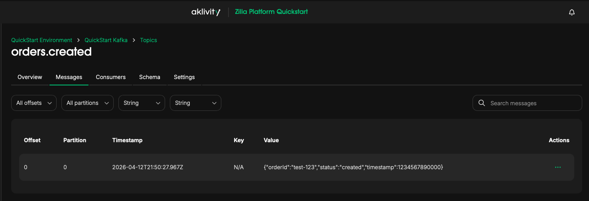

# HTTP/SSE to Kafka via Zilla Platform

This demo shows how [Zilla Platform](https://www.aklivity.io/) exposes a Kafka topic as a secure HTTP/SSE API, no custom backend code required.

**Use case:** A client POSTs an order event over HTTPS. Zilla routes it directly to a Kafka topic. Any subscriber listening on the same endpoint via Server-Sent Events receives the event in real time. JWT-based authorization controls who can publish vs. stream.

**What's running:**

| Component              | Role                                             |
|------------------------|--------------------------------------------------|
| Zilla Gateway          | Terminates TLS, validates JWTs, maps HTTP↔Kafka  |
| Kafka (KRaft)          | Event store: `orders.created` topic              |
| Zilla Platform Console | Manage and observe the Gateway and Kafka cluster |

**Endpoints exposed by Zilla:**

| Method      | Path              | Scope required  | Action                     |
|-------------|-------------------|-----------------|----------------------------|
| `POST`      | `/orders.created` | `proxy:publish` | Publish a message to Kafka |
| `GET` (SSE) | `/orders.created` | `proxy:stream`  | Stream messages from Kafka |

---

## Prerequisites

* **Docker Engine** `24.0+`
* **Docker Compose** plugin `2.34.0+`
* At least **4 vCPUs** and **4 GB RAM**
* A valid **Zilla Platform License**
* jwt-cli

## Get a License

Request a license key at https://www.aklivity.io/request-access, then set it in your environment:

```bash
export ZILLA_PLATFORM_LICENSE_KEY=<license>
```

If the license is missing or invalid, you'll see:

```
License is invalid, contact support@aklivity.io to request a new license
```

## Install jwt-cli client

Generates JWT tokens from the command line.

```bash
brew install mike-engel/jwt-cli/jwt-cli
```

## Start the Zilla Platform

Pull and start the full platform stack — management console, control plane, Gateway, Kafka, and Schema Registry:

```bash
docker compose -f oci://ghcr.io/aklivity/zilla-platform/quickstart up --wait && \
docker compose up --wait
```

Once ready, open the [**Zilla Platform Management Console**](http://localhost:8081/) in your browser.

## Admin Setup

The first time you open the console, complete the one-time admin registration to create your organization and initial environment.

See the [Admin Onboarding guide](https://docs.aklivity.io/zilla-platform/latest/platform/getting-started/admin-onboarding/) for step-by-step details.

## Publish an Event to Kafka

Generate a JWT with `proxy:publish` scope, then POST an event to the topic:

```bash
export JWT_TOKEN=$(jwt encode \
  --alg "RS256" \
  --kid "example" \
  --iss "https://auth.example.com" \
  --aud "https://api.example.com" \
  --sub "example" \
  --exp=+3000s \
  --no-iat \
  --payload "scope=proxy:publish" \
  --secret @private.pem)

curl -v -X POST \
  --cacert test-ca.crt \
  https://localhost:7143/orders.created \
  -H "Authorization: Bearer $JWT_TOKEN" \
  -H 'Content-Type: application/json' \
  -d '{"orderId":"test-123","status":"created","timestamp":1234567890000}'
```

## Stream Events via SSE

Generate a JWT with `proxy:stream` scope, then subscribe to the topic using Server-Sent Events:

```bash
export JWT_TOKEN=$(jwt encode \
  --alg "RS256" \
  --kid "example" \
  --iss "https://auth.example.com" \
  --aud "https://api.example.com" \
  --sub "example" \
  --exp=+3000s \
  --no-iat \
  --payload "scope=proxy:stream" \
  --secret @private.pem)

curl -v -N \
  --http2 \
  --cacert test-ca.crt \
  -H "Accept: text/event-stream" \
  "https://localhost:7143/orders.created?access_token=${JWT_TOKEN}"
```

### Output

```text
...
> Accept: text/event-stream
>
...
< HTTP/2 200
< content-type: text/event-stream
< access-control-allow-origin: *
<
id:AQYAAgIDBAM=
data:{"orderId":"test-123","status":"created","timestamp":1234567890000}
```

## Explore Kafka Topics in the Zilla Platform Console

Zilla Platform provides built-in visibility into your Kafka cluster directly from the management console, no separate tooling needed. Browse topics, inspect messages, and verify event flow in real time.

Navigate to: **Environments → `QuickStart Environment` → Services → `QuickStart Kafka` → Topics → `orders.created` → Messages**



## Stop the stack

Choose the appropriate command based on what you want to preserve.

Stop the data plane environment only (keeps platform data):

```bash
docker compose down
```

Stop the Zilla Platform (keeps all persisted data for next time):

```bash
docker compose -f oci://ghcr.io/aklivity/zilla-platform/quickstart down
```

Wipe everything and start fresh (removes all volumes):

```bash
docker compose down --volumes --remove-orphans && \
docker compose -f oci://ghcr.io/aklivity/zilla-platform/quickstart down --volumes --remove-orphans
```
